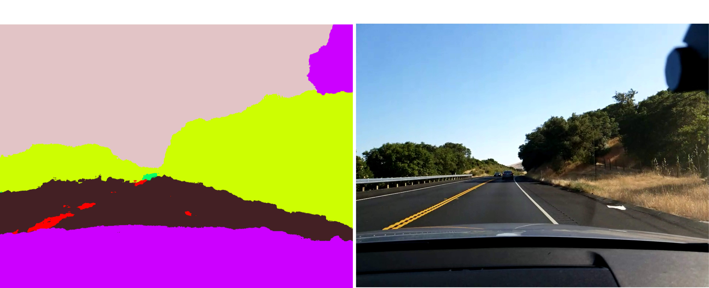
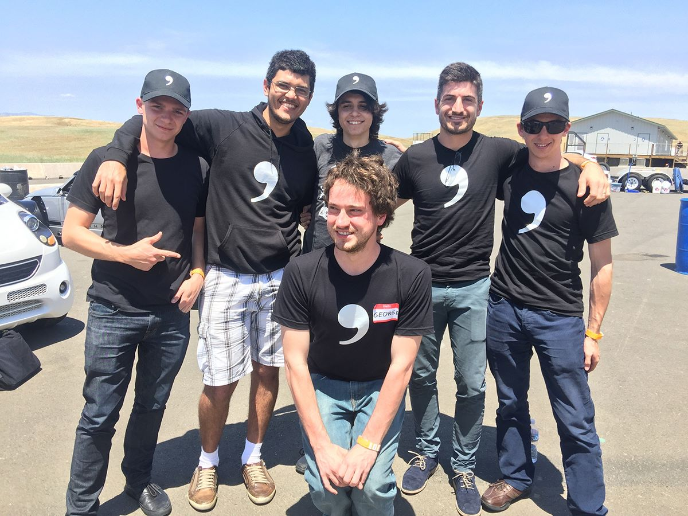
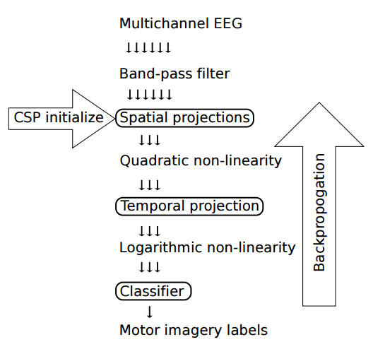
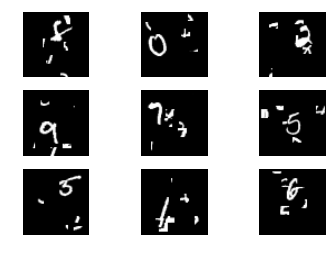
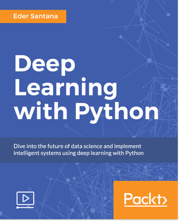

# projects

## [learning a driving simulator](http://research.comma.ai)
  
I trained generative adversarial and recurrent neural networks to simulate highway videos.

## [self coloring books](https://commaai.blogspot.com/2016/07/self-coloring-books.html)  
  
A segmentation network for self driving car data pipeline

## [deep learning for self-driving cars](https://www.facebook.com/Engadget/videos/vb.5738237369/10154178705732370/?type=2&theater)  
  
CNN+RNN model for deciding where the car should go during Summer at comma.ai

## [EEG analysis for Brain Machine Interface](https://github.com/EderSantana/DeepEEG)  
  
I wrote the CSP pipeline for EEG analysis in Theano and fine-tuned everything end-to-end. I could've won BCI competition 2 T_T

## [Information Theoretic Learning Autoencoders](http://arxiv.org/abs/1603.06653)  
  
I want to use deep information theoretic learning to compress and make images look pretty.

## [RGB-D object recognition](http://cnel.ufl.edu/files/1429900461.pdf)
  
I trained convnets to recognize objects in 3D when interning with Paracosm.io

## [ECG analysis](http://ieeexplore.ieee.org/document/5491129/?arnumber=5491129)
My undergrad and master research was on blind source extraction. We had ECG recordings from a pregnant woman and we had to
separate the ECG signal of the fetus from the signal of the woman. I used kernels methods back then. You kids don't know
that anymore, but kernels used to be cool.

## [Keras contributor](https://github.com/fchollet/keras)  
   
Keras' community is awesome! I contributed a little bit of Tensorflow and Theano to the source. Specially on
[networks](https://github.com/EderSantana/seya/blob/master/examples/NTM.ipynb) that learn to pay
[attention](https://github.com/EderSantana/seya/blob/master/examples/Spatial%20Transformer%20Networks.ipynb) to interesting
stuff.

## [Hubot Recognizer](https://github.com/EderSantana/hubot-recognizer/blob/master/images/pug_it_is.png?raw=true)  
  
I put some deep learning on Slack

## [deep learning with python](https://www.packtpub.com/big-data-and-business-intelligence/deep-learning-python-video)
  
video course about deep learning. Mostly using Keras and Theano.

## [publications](http://cnel.ufl.edu/people/people.php?name=eder)
papers, in the end of the day I write machine learning papers for a living
