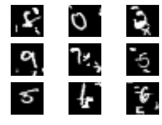

# projects

[self coloring books](https://commaai.blogspot.com/2016/07/self-coloring-books.html)  
  
A segmentation network for self driving car data pipeline

[deep learning for self-driving cars](https://www.facebook.com/Engadget/videos/vb.5738237369/10154178705732370/?type=2&theater)  
  
CNN+RNN model for deciding where the car should go during Summer at comma.ai

[EEG analysis for Brain Machine Interface](https://github.com/EderSantana/DeepEEG)  
  
I wrote the CSP pipeline for EEG analysis in Theano and fine-tuned everything end-to-end,
if I could've won BCI competition 2 T_T

[Information Theoretic Learning Autoencoders](http://arxiv.org/abs/1603.06653)  
  
I want to use information theory to compress and make images look pretty.

[Keras contributor](https://github.com/fchollet/keras)  
   
Keras' community is awesome! I contributed a little bit to the source. Specially on [networks]() that learns to pay [attention](https://github.com/EderSantana/seya/tree/master/examples) to interesting stuff.

[Hubot Recognizer](https://github.com/EderSantana/hubot-recognizer/blob/master/images/pug_it_is.png?raw=true)  
  
I put some deep learning on Slack
