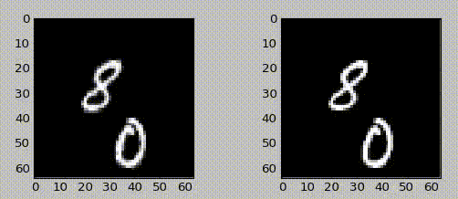
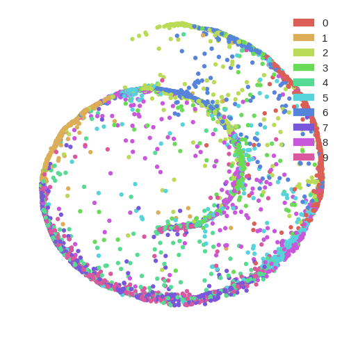

# projects

## generative models and unsupervised learning for videos  
  
I wrote [Recurrent Winner-Take-All](https://arxiv.org/abs/1611.00050) and [Perception Updating Networks](https://openreview.net/pdf?id=H1JBMVpdx). Those methods show how to learn features by exploiting temporal context and to predict future frames in a video (think video compressor or robot planning).

## [subpixel](https://github.com/Tetrachrome/subpixel)  
   
Enhance! A neural network for image superresolution. This project hit the front page of Hacker News and Trending on Github.

## [pymerkletools](https://github.com/Tierion/pymerkletools)
  
I love bitcoin and blockchain! I wrote [Tierion](https://tierion.com)'s [pymerkletools](https://github.com/Tierion/pymerkletools) for creating Merkle trees, generating merkle proofs, and verification of merkle proofs.

## [learning a driving simulator](http://research.comma.ai)
  
I trained generative adversarial and recurrent neural networks to simulate highway videos.

## [self coloring books](https://commaai.blogspot.com/2016/07/self-coloring-books.html)  
  
A segmentation network for self driving car data pipeline

## [deep learning for self-driving cars](https://www.facebook.com/Engadget/videos/vb.5738237369/10154178705732370/?type=2&theater)  
  
CNN+RNN model for deciding where the car should go during Summer at comma.ai

## [EEG analysis for Brain Machine Interface](https://github.com/EderSantana/DeepEEG)  
  
I wrote the CSP pipeline for EEG analysis in Theano and fine-tuned everything end-to-end. I could've won BCI competition 2 T_T

## [Information Theoretic Learning Autoencoders](http://arxiv.org/abs/1603.06653)  
  
I want to use deep information theoretic learning to compress and make images look pretty.

## [RGB-D object recognition](http://cnel.ufl.edu/files/1429900461.pdf)
  
I trained convnets to recognize objects in 3D when interning with Paracosm.io

## [ECG analysis](http://ieeexplore.ieee.org/document/5491129/?arnumber=5491129)
My undergrad and master research was on blind source extraction. We had ECG recordings from a pregnant woman and we had to
separate the ECG signal of the fetus from the signal of the woman. I used kernels methods back then. You kids don't know
that anymore, but kernels used to be cool.

## [Keras contributor](https://github.com/fchollet/keras)  
   
Keras' community is awesome! I contribute with both Tensorflow and Theano code to the source. Some advanced contributions
include [Neural Turing Machines](https://github.com/EderSantana/seya/blob/master/examples/NTM.ipynb) and
[Spatial Transformer Networks](https://github.com/EderSantana/seya/blob/master/examples/Spatial%20Transformer%20Networks.ipynb).

## [Hubot Recognizer](https://github.com/EderSantana/hubot-recognizer)  
  
I put some deep learning on Slack

## [deep learning with python](https://www.packtpub.com/big-data-and-business-intelligence/deep-learning-python-video)
  
video course about deep learning. Mostly using Keras and Theano.

## [publications](http://cnel.ufl.edu/people/people.php?name=eder)
papers, in the end of the day I write machine learning papers for a living
